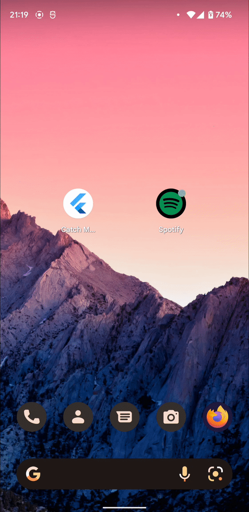

# <p align="center">Catch My Cadence</p>
<p align="center">
  An application that plays songs with a BPM matching your running cadence.
</p>

<p align="center">
  
</p>

## Getting Started
Minimal steps to run this application.
1. Clone the repo (or pull it).
2. Run these commands to get required plugins and update them:
```cmd
$ flutter upgrade          `Optional: To make sure your Flutter runtime is up to date`
$ flutter clean            `Optional: Cleans the flutter app directory`
$ flutter pub get          `Gets dependencies`
$ flutter pub upgrade      `Upgrades dependencies`
```
3. Set up your `/assets/secrets.env` file. You may look at `secrets.env.example` file provided for more
information.
4. Choose ONE of the following commands to run the app (you will need to connect a phone):
```cmd
$ flutter run               `Default: Runs the app in debug mode`
$ flutter run --release     `Runs the app in release mode.`
```
NOTE: Running the app in release mode reduces app 'jankiness'. However, there is no logging or debugging
output.

## To-Do
- [ ] Testing
- [ ] Reconcile application and documentation details.

## FAQ
### I get a `UserNotAuthorizedException` when running the app!
- First check that you have defined all required secrets in your `secrets.env` file.
- If you are running the app on Android, you will also need a valid SHA1 key to run the app. 
    - Follow the instructions [here](https://developer.spotify.com/documentation/android/quick-start/index%20copy/) 
    in the `Register App Fingerprints` section.
    - Contact <b>@darylhjd</b> to whitelist your SHA1 key.
